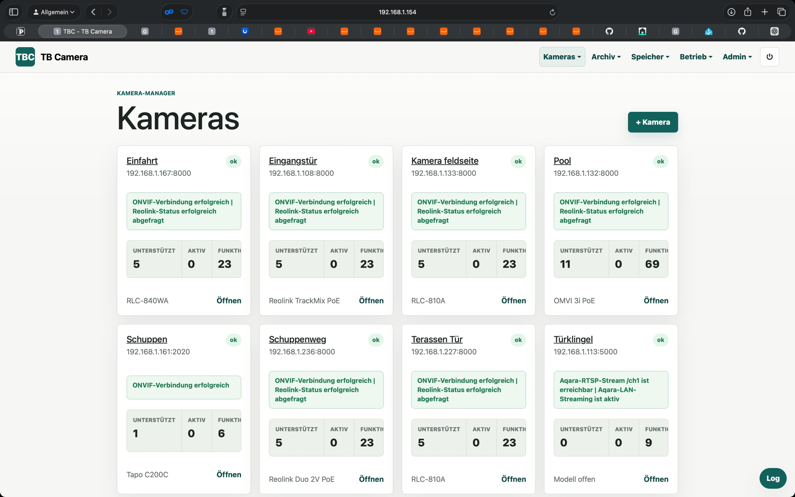
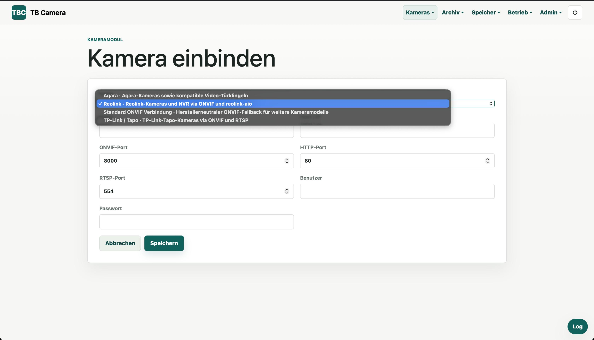
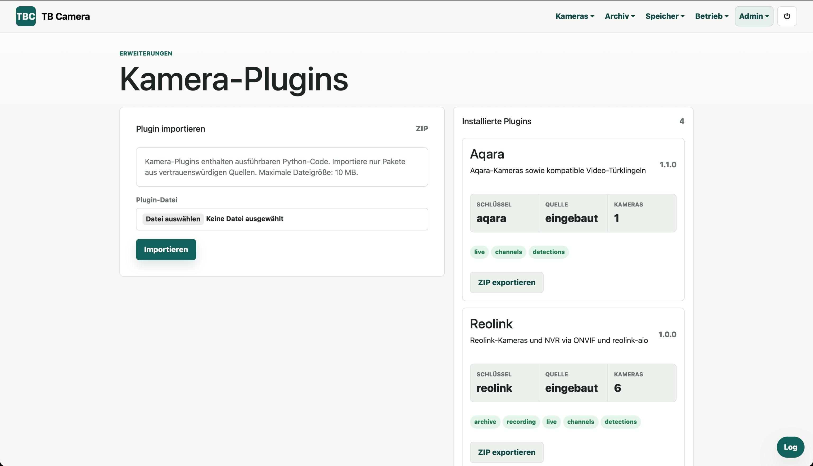
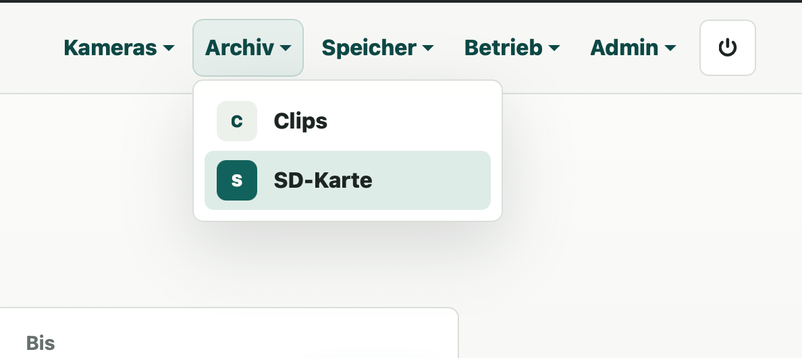
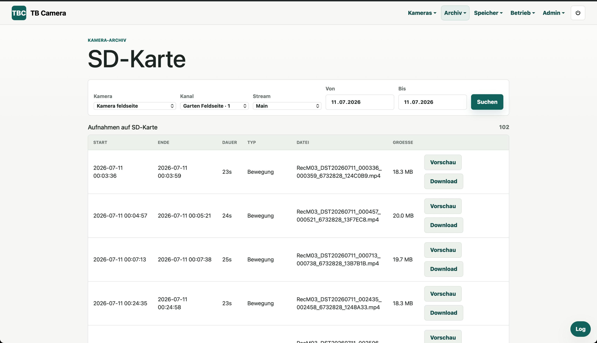
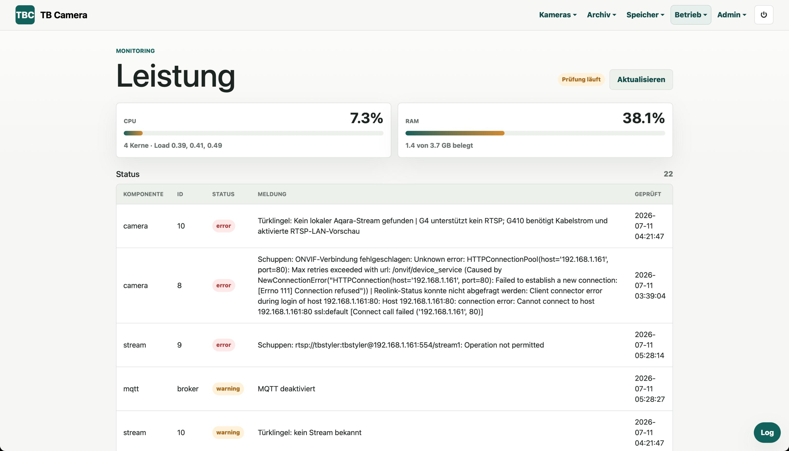

# TBC - TB Camera

TBC is a modular, Docker-based camera manager. Camera vendors are integrated through installable camera modules. Reolink, Aqara, TP-Link/Tapo, Axis, Foscam, Hikvision, Dahua (including Amcrest/Annke OEM devices), Ubiquiti/UniFi Protect, and SONOFF are available as directly installable standard repositories. A generic ONVIF fallback and a vendor-neutral RTSP-only profile remain built in.

The application includes authentication, camera management, RTSP stream discovery, dashboard snapshots, event-based and continuous recording, clip and SD-card browsers, user roles, MQTT and Home Assistant integration, live HLS, retention rules, notifications, health monitoring, AI detection, and NVR channel management.

English is the default interface language. German and Spanish can be selected from the language menu.

## Quick start

```bash
cp .env.example .env
docker compose up --build
```

Open the web interface at <http://localhost:8732>.

Default values from `docker-compose.yml`:

- Username: `admin`
- Password: `bitte-aendern`
- Web port: `8732`
- Database: `/data/tbc.sqlite3` in the `tbc-data` Docker volume
- Recordings: `/recordings` in the `tbc-recordings` Docker volume
- Live HLS buffer: `/tmp/tbc-live`
- Imported camera plugins: `/data/camera-modules`
- Imported cloud plugins: `/data/cloud-modules`
- Imported design themes: `/data/design-themes`
- Dashboard snapshots: `/data/dashboard-snapshots`, refreshed every 600 seconds by default

Change `TBC_ADMIN_PASSWORD` and `TBC_SECRET_KEY` in `.env` before using TBC outside a test environment. Set `TBC_PUBLIC_BASE_URL` when webhooks or Home Assistant notifications should include links to clips and snapshots.

## Home Assistant OS

This repository is also a Home Assistant app repository. In Home Assistant, open `Settings → Apps → App store`, open the repository menu, and add:

```text
https://github.com/404GamerNotFound/TBC-camera-manager
```

The app uses the same application image as the regular Docker deployment and supports `amd64` and `aarch64`. Application data is stored in the private Home Assistant app directory, while recordings are written to `/media/tbc-camera-manager`. Set an administrator password in the app configuration before the first start.

See [`tbc_camera_manager/DOCS.md`](tbc_camera_manager/DOCS.md) for configuration options, persistence, MQTT, and implementation details.

## Portainer installation

Portainer should build this project as a standalone stack from its Git repository. The Compose stack contains `build: .`; pasting only the Compose file into the web editor omits the Dockerfile, application code, and `requirements.txt` from the build context.

1. Open `Stacks` in Portainer and select `Add stack`.
2. Select `Repository` or `Git repository` as the build method.
3. Enter the repository URL and branch, and use `docker-compose.yml` as the Compose path.
4. Configure at least:

   ```text
   TBC_ADMIN_USERNAME=admin
   TBC_ADMIN_PASSWORD=<strong-password>
   TBC_SECRET_KEY=<long-random-string>
   TBC_PORT=8732
   ```

5. Optionally set `TBC_PUBLIC_BASE_URL=https://your-hostname`.
6. Deploy the stack and open `http://<docker-host>:8732`.

Do not deploy it as a Swarm stack unless you use a prebuilt registry image, because Docker Swarm ignores local `build` instructions. Add bind mounts to `docker-compose.yml` when recordings should be stored on a NAS or host directory, then register the container path under `Storage` in TBC.

## Adding cameras

`Add camera` first asks whether the camera is local or comes from a cloud account.

- A local camera is configured with an installed camera module, host/IP, ports, and credentials.
- A cloud account connects to a vendor account and discovers its cameras automatically.

The selected module determines which vendor API is queried and which capabilities are exposed.





## Camera modules

The web interface and camera routes use a vendor-independent `CameraModule` interface. Modules declare support for live view, event recording, detections, multi-channel devices, controls, firmware operations, and camera archives.

Camera plugin ZIP files can be imported and exported under `Admin → Camera plugins`. Imported packages are persisted under `TBC_CAMERA_MODULES_PATH` and become available immediately. Standard public repositories can be registered under `Admin → External sources`. See [docs/plugin-sources.md](docs/plugin-sources.md) and [docs/camera-modules.md](docs/camera-modules.md).

Existing databases are migrated automatically. Legacy cameras are assigned the `reolink` module.

Notable profiles:

- `standard_onvif` uses only ONVIF device information, media profiles, event definitions, and stream URIs reported by the camera.
- `rtsp_only` accepts a complete RTSP/RTSPS URL and skips ONVIF entirely.
- `tplink` supports TP-Link/Tapo cameras through ONVIF Profile S and RTSP, with ONVIF port `2020` and RTSP port `554` as defaults.
- `aqara` checks ONVIF-compatible Aqara cameras on port `5000` and the local RTSP channel `/ch1` on port `8554`.
- `axis`, `foscam`, `hikvision`, and `dahua` use ONVIF and vendor-typical RTSP fallbacks. The Dahua module also covers common Amcrest and Annke OEM devices.
- `ubiquiti` and `sonoff` use complete stream URLs generated by UniFi Protect or eWeLink.

Credentials embedded in RTSP/RTSPS URLs are always rendered as `***:***` in forms, status messages, and detail views.



## Cloud accounts

Cloud plugins are separate from camera modules. A cloud plugin signs in once, lists the cameras associated with the account, and imports selected devices as regular TBC cameras. Imported cameras then use the same live-view and control infrastructure as local cameras.

Cloud plugins are managed under `Admin → Cloud providers`; actual accounts are managed from the camera setup flow. Providers may request a verification code through a dedicated 2FA page.

The standard repositories include:

- `unifi_protect` for local controllers and the `ui.com` cloud console
- `eufy` with email verification-code support
- `ewelink` for the official CoolKit Open Platform API

See [docs/cloud-accounts.md](docs/cloud-accounts.md).

## External sources, updates, and plugin tests

Public GitHub repositories can be registered as plugin sources instead of uploading ZIP files manually. Synchronization downloads and validates the current branch, tag, or subdirectory through the same safety checks as uploaded packages. TBC checks registered sources hourly by comparing commit SHAs and lists available updates under `Admin → Updates`.

Camera and cloud plugins may include a `tests/` directory. These tests can be run directly from the corresponding plugin administration page. Ready-to-install templates are available for camera plugins, cloud plugins, and themes.

## Design themes

Design themes are isolated packages containing a manifest, stylesheets, metadata, and images, but no executable code. TBC ships with `standard` and `midnight`. Theme ZIP files can be imported, exported, activated, and removed under `Admin → Design`.

Imported themes are persisted under `TBC_THEME_MODULES_PATH`. Built-in themes cannot be overwritten or removed, and the active theme cannot be removed. See [docs/design-themes.md](docs/design-themes.md).

## Dashboard snapshots

For each enabled camera with a known stream, TBC uses `ffmpeg` to generate a JPEG preview. The protected cache is refreshed at the configured interval. The snapshot route applies the same authentication and per-camera authorization checks as detail and live views.

Configure the location and interval with `TBC_DASHBOARD_SNAPSHOTS_PATH` and `TBC_DASHBOARD_SNAPSHOT_INTERVAL_SECONDS`.

## Recordings and storage

TBC supports event recordings and continuous recording. Configurable values include the storage destination, minimum duration, pre-roll, post-roll, cooldown between clips, snapshots/thumbnails, and event types.

Recordings use the discovered RTSP stream and `ffmpeg`. Storage destinations can be:

- A local or mounted container path such as `/recordings` or `/recordings/nas`
- S3-compatible object storage with endpoint, region, bucket, prefix, access key, and secret key

The clip browser supports filtering, playback, download, and administrator deletion. Local clips are served from the container; S3 clips use temporary presigned URLs.

## SD card and camera archive

For supported cameras, the `SD card` area reads recordings directly from the camera or NVR. Reolink archive access uses the VOD API from `reolink-aio` for search, playback, and download.

Users can filter by camera, channel, stream, and date. Viewer accounts see only archives belonging to assigned cameras. Camera-side files are not imported into the TBC recording table and are not affected by TBC retention rules.





## Live view

TBC starts an authenticated HLS proxy through `ffmpeg` for each camera or NVR channel. Playback uses the built-in [video-player.js](app/tbc/static/video-player.js) and the bundled [hls.js](app/tbc/static/vendor/hls.min.js).

Supported controls include play, mute, fullscreen, recording scrubbing, and optional PTZ overlays. The live wall supports kiosk fullscreen, focused camera view, configurable grid density, per-tile sizing, drag-and-drop ordering, and optional page rotation.

## AI detection

Local AI detection can identify people, vehicles, and animals independently of events reported by the camera. CPU is supported by default; separately built images can provide CUDA or Coral Edge TPU runtimes. Per-camera settings include backend, sample rate, confidence threshold, event triggers, and inclusion, exclusion, or loitering zones.

See `Dockerfile.gpu`, `Dockerfile.coral`, and the in-app `AI detection` page for runtime requirements.

## Retention and storage explorer

Administrators can create retention rules globally, per camera, or per event type. Rules may delete recordings after a maximum age or when a size limit is exceeded. Storage destinations can also define their own age and size limits.

The storage explorer shows free space, usage by camera and event, and a cleanup preview. The same preview logic is used by manual cleanup and the hourly background cleanup.

## Notifications

Notification channels include webhooks, Telegram, SMTP email, Pushover, and Home Assistant Notify. Channels can include snapshots and public clip links where supported, and can be restricted with a comma-separated event filter such as:

```text
recording_finished,recording_failed,cleanup_finished,health_status_changed
```

## Health monitoring

Health checks cover camera probe status, stream readability through `ffprobe`, local storage destinations, and MQTT connectivity. Status changes are stored as health events. Checks run in the background and can also be triggered from the web interface.



## NVR and multi-channel management

When a module reports multiple channels, TBC stores them individually. Channels can be renamed, disabled, and started independently in live view. Disabled channels do not produce active detections or recordings. Camera controls retain their channel association.

## Users and roles

- `admin` can manage cameras, storage, MQTT, users, plugins, settings, and recordings.
- `viewer` can access only explicitly assigned cameras and their recordings.

## MQTT and Home Assistant

TBC publishes camera and detection states under the configured MQTT topic prefix and can publish Home Assistant discovery messages. Recording events such as `recording_started`, `recording_finished`, and `recording_failed` are also published.

The read-only REST API and MCP interface are configured under `Admin → API access`. See [docs/api.md](docs/api.md) and [docs/mcp.md](docs/mcp.md).

## Technical architecture

- Web server: FastAPI with Jinja2 templates
- Persistence: SQLite, normally at `/data/tbc.sqlite3`
- Authentication: signed cookie sessions and PBKDF2-SHA256 password hashes
- ONVIF: `onvif-zeep` for device, media, and event probes
- Reolink: `reolink-aio` for model-specific AI state, PTZ presets, archives, and firmware operations
- Recording: `ffmpeg`, pre-roll ring-buffer segments, and optional `boto3` S3 uploads
- Live view: authenticated HLS playlists and segments generated by `ffmpeg`
- Snapshots: atomic JPEG replacement managed by `DashboardSnapshotManager`
- Debug log: in-memory ring buffer for application and `ffmpeg` messages
- Retention: `app/tbc/maintenance.py`
- Notifications: `app/tbc/notifications.py`
- Health monitoring: `app/tbc/health.py`
- MQTT: `paho-mqtt` with optional Home Assistant discovery
- Deployment: Dockerfile, Docker Compose, and Home Assistant app packaging
- Health endpoint: `/healthz`

## Development

```bash
pytest -q
python -m unittest discover -s tests
python -m compileall app tests
docker compose config
```
